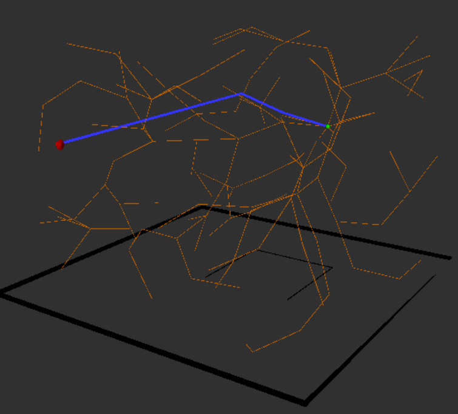
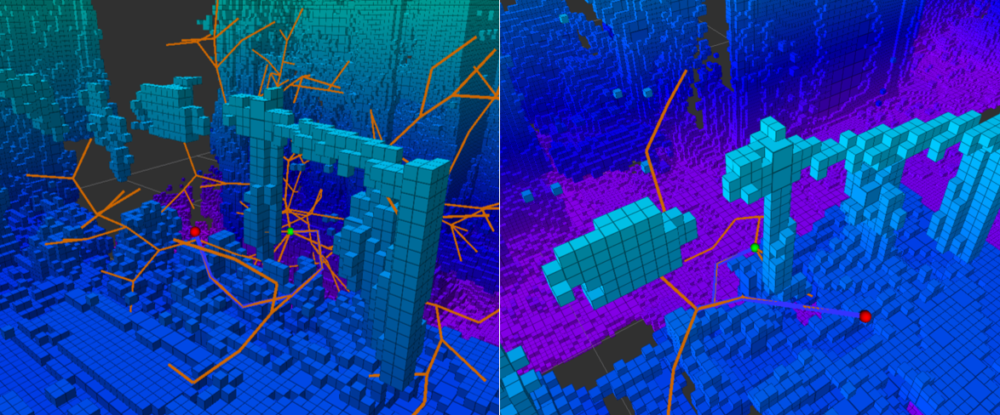

## Description
A 3D collision-free path planning algorithm based on RRT and SP-RRT specialized for 8-link hyper-redundant robot implemented using ROS.

**Distro:**
  Ros neotic <br  />

The algorithm find an 3D optimized path for obstacle environments. The visualtization is done in **RVIZ** and the majority code is written in **C++**. This package also offer implementation for using **Octomap** as obstacle-environment. <br  />

The package has **four** executables: <br  />
1. rrt_node <br  />
2. sp_rrt node <br />
3. env_node <br  />
4. sp_rrt_node_octomap<br  />

## RVIZ parameters:  <br  />
1. Frame_id = "/path_planner"  <br  />
2. Marker_topic = "path_planner_rrt"  <br  />
3. MarkerArray_topic = "/occupied_cells_vis_array" <br />


## Instructions for plain RRT and SP-RRT:
1. Open terminal and type  <br  />
  ```roscore```  <br  />
2. Open new terminal and go to the the root of your catkin workspace  <br  />
  ```catkin_make``` <br  />
  ```source ./devel/setup.bash```<br  />
  ```rosrun path_planner env_node``` <br  />
3. open new terminal  <br  />
  ```rosrun rviz rviz ``` <br  />
4. In the RVIZ window, change:  <br  />
  fixed frame under global option to "path_planner"  <br  />
  add a marker and change marker topic to "path_planner_rrt"  <br  />
5. Open new terminal  <br  />
  To run RRT algorithm:
  ```rosrun path_planner rrt_node```  <br  /> 
  To run SP_RRT algorithm:
  ```rosrun path_planner sp_rrt_node``` <br />

## Instructions for SP-RRT in Octomap:
1. Open file `launch/octomap_tracking_server.launch` and change `<arg name="path" default="/XXX/src/path_planning/octomap/freiburg1_360.bt"/>` into your own root. <br />
2. Open terminal and type <br />
  ```catkin_make  ```<br  />
  ```source ./devel/setup.bash ``` <br  />
  ```rosrun path_planner env_node ``` <br  />
3. open new termianl <br />
  ```roslaunch path_planning octomap_tracking_server.launch ```<br />
4. open new terminal  <br  />
```rosrun rviz rviz``` <br  />
5. open new terminal <br />
```rosrun path_planning sp_rrt_octomap``` <br />
6. In the RVIZ window, change:  <br  />
  fixed frame under global option to "path_planner"  <br  />
  add a Marker and change marker topic to "path_planner_rrt"  <br  />
  add a MarkerArray and change topic to "occupied_cells_vis_array"

## Reference:<br />
**Code:** based on a planar RRT implementation from https://github.com/nalin1096/path_planning. <br />
**SP-RRT:** H. Wei, Y. Zheng and G. Gu, "RRT-Based Path Planning for Follow-the-Leader Motion of Hyper-Redundant Manipulators," 2021 IEEE/RSJ International Conference on Intelligent Robots and Systems (IROS), 2021, pp. 3198-3204.<br />
**Octomap:** `fr_078_tidyup.bt` and `freiburg1_360.bt` are from Autonome Intelligente Systeme, Albert-Ludwigs-Universität Freiburg. The relevent link is http://ais.informatik.uni-freiburg.de/projects/datasets/octomap/.

## Visualization Display
 <br  />
**[Fig1. plain sp-rrt]**

 <br  />
**[Fig.2 sp-rrt in octomap]**